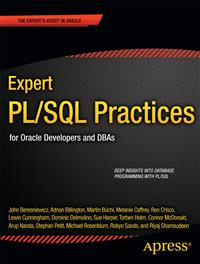

# Apress Source Code

This repository accompanies [*Expert PL/SQL Practices*](http://www.apress.com/9781430234852) by Michael Rosenblum, Dominic Delmolino, Lewis Cunningham, Riyaj Shamsudeen, Connor McDonald, Melanie Caffrey, Sue Harper, Torben Holm, Robyn Sands, John Beresniewicz, Ron Crisco, Martin Bchi, Adrian Billington, Stephan Petit, and Arup Nanda (Apress, 2011).

Download the files as a zip using the green button, or clone the repository to your machine using Git.

## Releases

Release v1.0 corresponds to the code in the published book, without corrections or updates.

## Contributions

See the file Contributing.md for more information on how you can contribute to this repository.
